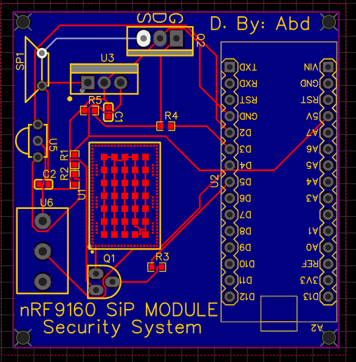

# 🚨 Security Alarm System

## 🔹 Overview
This project is a **security alarm system** designed to detect the presence of a person in an area using the **HLK-LD2410 Distance Detection Radar Sensor**. If someone is detected, the system sends an **alert message** to the user via the **nRF91060 4G module**. The system is powered by the **LM7805G** voltage regulator and is controlled by an **Arduino Nano**.

### Key Components:
- **HLK-LD2410**: Distance detection radar sensor to detect if a person is present in the area.
- **nRF91060**: 4G module for sending an alert message to the user.
- **LM7805G**: Voltage regulator to provide stable 5V power to the system.
- **Arduino Nano**: Microcontroller to drive the siren and control the 4G module.

---

## 🔹 Features:
- 🚨 **Person Detection**: Uses the **HLK-LD2410** radar sensor to detect the presence of a person in the area.
- 📡 **Alert Message**: Sends an alert via the **nRF91060** 4G module when a person is detected.
- 🔊 **Siren**: A siren is triggered to notify people in the area that someone has been detected.
- 🔋 **Stable Power Supply**: Powered by the **LM7805G** voltage regulator to ensure a reliable 5V supply.

---

## 🔹 Schematic & PCB Design:
Here is the **schematic diagram** for the security alarm system:  

Below is the **PCB design**:  

---

## 🔹 3D Model:
Here are the **3D models** of the PCB for a better visualization:  
- **Top View**  
  

---

## 🔹 How It Works:
1. The **HLK-LD2410 radar sensor** detects if a person is present in the area.
2. If a person is detected, the **Arduino Nano** triggers the **siren** and activates **pin P0.06** on the **nRF91060 4G module**.
3. The **nRF91060 module** then sends an alert message to the user, notifying them that someone has been detected.
4. The **LM7805G** voltage regulator ensures that the system operates at a stable 5V, providing reliable performance.

---

## 🔹 Future Improvements:
- 🛠️ Add a **camera module** for visual verification of detected persons.
- 🔧 Integrate **motion sensors** for more precise detection.
- 🔊 Implement different alarm types (e.g., loud sirens, flashing lights).

