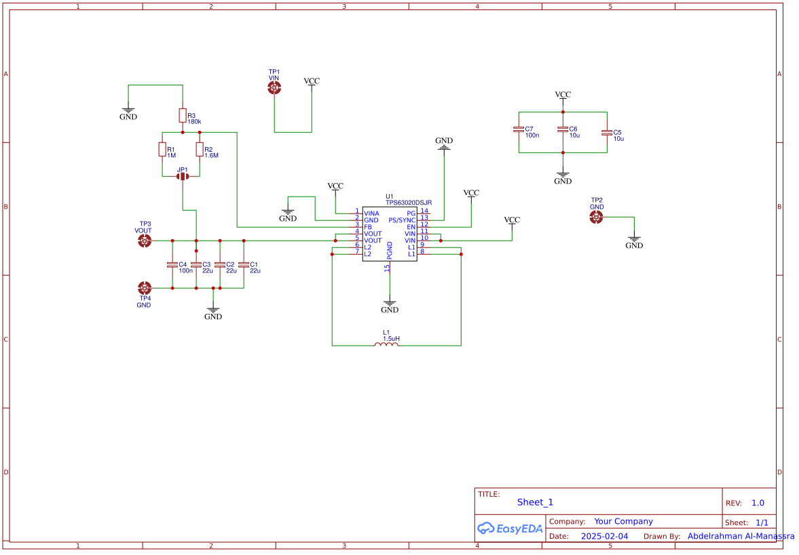
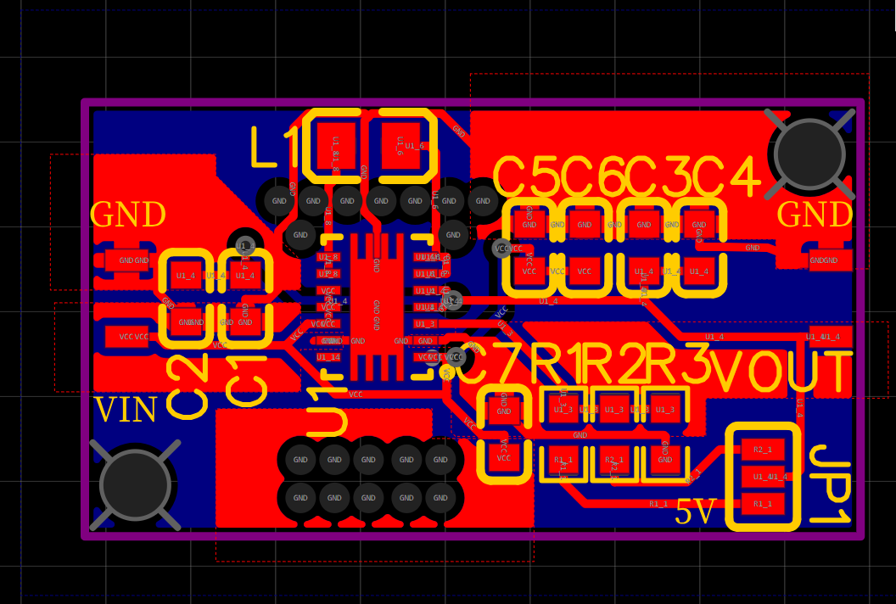
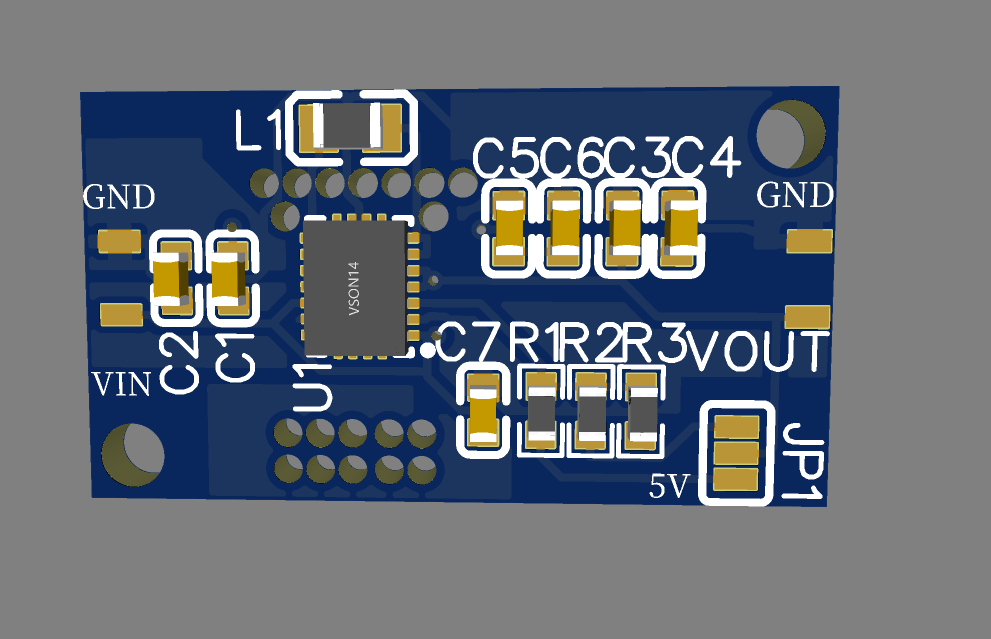

# 🔋 Single Inductor Boost Converter (TPS6302)

## 🔹 Overview
This project is a **single inductor boost converter** using the **TPS6302** IC, which functions as a **buck-boost converter**. It efficiently regulates the output voltage even when the input voltage fluctuates. 

### Key Specifications:
- **Input Voltage Range**: 1.8V to 5.5V  
- **Adjustable Output Voltage**: 1.2V to 5.5V  
- **Output Current (VIN > 2.5V, VOUT = 3.3V)**: Up to 2A  
- **High Efficiency** over the entire load range  
- **Low Operating Quiescent Current**: 25 µA  
- **Power Save Mode**: Selectable via mode selection pin  

---

## 🔹 Features:
- ⚡ **Buck-Boost Regulation**: Provides a stable output regardless of whether the input voltage is above or below the desired output.  
- 🔋 **Energy Efficient**: Low quiescent current (25 µA) ensures minimal power consumption.  
- 🔄 **Power Save Mode**: Improves efficiency at light loads.  
- 🔧 **Adjustable Output Voltage**: Can be configured between 1.2V and 5.5V.  

---

## 🔹 Schematic & PCB Design:
Here is the **schematic diagram** for the boost converter:  

Below is the **PCB design**:  

---

## 🔹 3D Model:
Here are the **3D models** of the PCB for better visualization:  
- **3D view**  
  

---

## 🔹 How It Works:
1. The **TPS6302 IC** dynamically switches between **boost mode** and **buck mode** depending on the input voltage.  
2. The **inductor stores and transfers energy**, allowing for efficient voltage conversion.  
3. The **output voltage** is adjustable based on external resistors, supporting a range from **1.2V to 5.5V**.  
4. The **power save mode** enhances efficiency at light loads by reducing switching frequency.  

---

## 🔹 Future Improvements:
- 🛠️ Optimize PCB layout for reduced noise and better thermal performance.  
- 🔧 Experiment with different inductor values to improve efficiency.  
- 🔋 Add a battery management system for portable applications.  

---

## 🔹 License:
This project is open-source. Feel free to modify and improve it!

