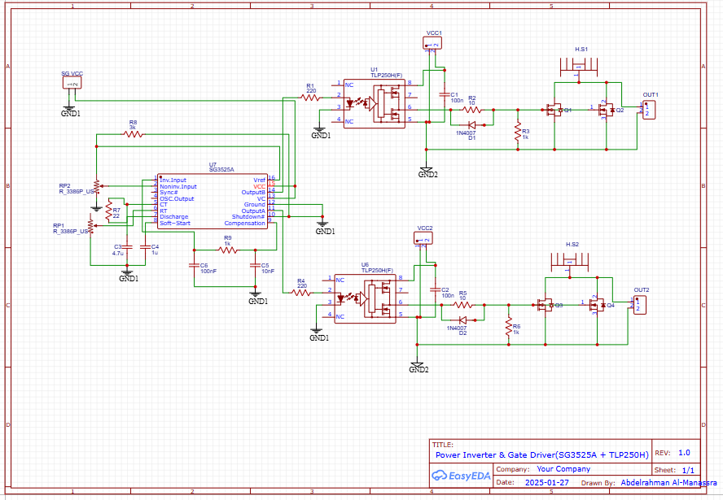

# ⚡ SG3525A-Based PWM Controller with TLP250 Gate Drivers

## 🔹 Overview
This project is a **high-power gate driver circuit** using the **SG3525A PWM controller** and **TLP250 optocouplers**. It is designed to drive **MOSFETs or IGBTs** in applications such as **DC-AC inverters, SMPS (Switched-Mode Power Supplies), and motor drivers**.

### **Key Features:**
- **SG3525A PWM Control**: Generates two complementary PWM signals.
- **TLP250 Optocouplers**: Provide **isolation** and **boost gate drive strength**.
- **Push-Pull / Full-Bridge Compatible**: Can drive **high-voltage MOSFETs/IGBTs**.
- **Adjustable Dead Time**: Prevents **shoot-through** in power switching.
- **Isolated Grounds**: **GND1 (Control Side) and GND2 (Power Side) are separated**.

---

## 🔹 Work Principle:
### **1. SG3525A Generates PWM Signals**  
- The **OUTA and OUTB** pins of SG3525A produce **complementary PWM signals**.  
- The **duty cycle and frequency** are adjustable based on external components.  
- The **SG3525A operates with GND1 (low-voltage control ground).**  

### **2. TLP250 Provides Optical Isolation & Gate Drive**  
- The **input side** of the TLP250 is powered from **GND1** and driven by SG3525A.  
- The **output side** of the TLP250 is referenced to **GND2 (MOSFET power ground).**  
- TLP250 **amplifies the PWM signals** to properly switch MOSFETs/IGBTs.  

### **3. MOSFET/IGBT Switching**  
- The boosted PWM signals turn **power transistors ON and OFF efficiently**.  
- The power MOSFETs/IGBTs operate with **GND2 as their reference**.  

---

## 🔹 Isolated Ground Design:
In this circuit, **two separate grounds** are used:

| Ground | Purpose |
| **GND1** | Low-voltage control ground (SG3525A, input side of TLP250) |
| **GND2** | High-power ground (MOSFET source or IGBT emitter, output side of TLP250) |

⚠️ **Important:**  
- **The TLP250 output side must be powered by the MOSFET driver supply (e.g., 12V or 15V) with respect to GND2**.  
- **The SG3525A remains isolated from high-power switching noise**.  

---

## 🔹 Schematic & PCB Design:
Here is the **schematic diagram**:  

Below is the **PCB layout**:  

---

## 🔹 3D Model:
- **Top View**  
  

- **Side View**  
  

---

## 🔹 Applications:
✅ **DC-AC Inverters**: Converts **12V/24V DC to AC** for UPS or solar inverters.  
✅ **High-Power SMPS**: Used in power supply and voltage conversion.  
✅ **Motor Drivers**: Drives **AC/DC motors with PWM control**.  
✅ **Induction Heating**: Used in **high-frequency power applications**.  

---

## 🔹 Future Improvements:
- 🛠️ Improve **MOSFET gate drive** for higher efficiency.  
- ⚡ Implement **feedback control** for voltage and current regulation.  
- 🔋 Add **battery management** for standalone inverter applications.  

---

## 🔹 License:
This project is open-source. Feel free to modify and improve it!

