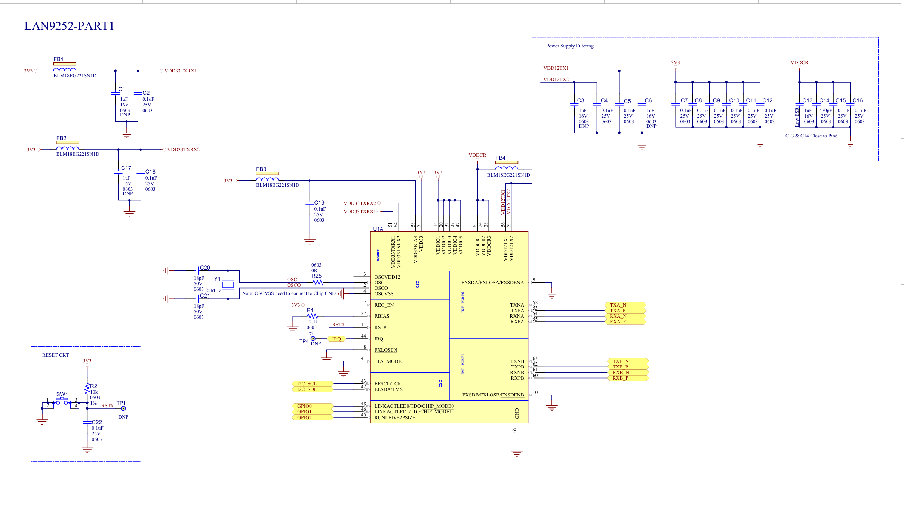

                        #UNDERPROCESSING# 
 🧠 Custom LAN9252 EtherCAT Slave Board (SPI Interface)

This project is a **custom hardware design** based on the **Microchip LAN9252** EtherCAT slave controller using an **SPI interface**. It is derived from the reference design **EVB-LAN9252-SPI**, with hardware adjustments for better integration and application-specific improvements.

---

## 🚀 Overview

EtherCAT (Ethernet for Control Automation Technology) is a real-time industrial Ethernet protocol ideal for high-performance control systems. The **LAN9252** from Microchip enables simple integration of EtherCAT into embedded devices.

This custom board serves as a **compact EtherCAT slave** that communicates with a host MCU over **SPI**. It's optimized for embedded system developers and automation engineers.

---

## 🛠️ Project Highlights

- ✅ Based on **LAN9252 EtherCAT slave controller**
- ✅ **SPI interface** for host MCU connectivity
- ✅ Two **RJ45 ports (Port A & Port D)** for EtherCAT IN/OUT
- ✅ Exposed **GPIOs, IRQ, SYNC, and RESET** via pin headers
- ✅ On-board **status and strap configuration LEDs**
- ✅ Includes **RS485 header** for serial communication (optional)
- ✅ Modular design suitable for real-time automation

This project is released as open-source hardware and is part of an ongoing effort to customize the original EVB-LAN9252-SPI design for more flexible integration and prototyping.

🛠️ Current Modification:
The original Board-to-Board (B2B) connector is being replaced with a 10-pin header for easier connectivity.
The selected header is:
🔧 TE Connectivity 5-1775444-6 (2x5, 1.27mm pitch, SMT header)
