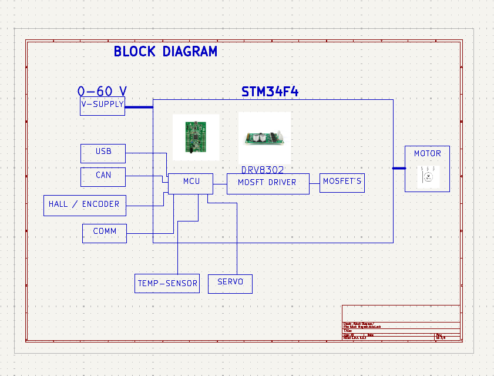

# Electronic Speed Controller (ESC)

This project is an **Electronic Speed Controller (ESC)** designed for driving Brushless DC (BLDC) motors.  
It integrates an **STM32Fxxx microcontroller** with the **DRV8302 MOSFET driver** to provide efficient and precise motor control.

---

## Features
- **MCU:** STM32Fxxx series (ARM Cortex-M)  
- **Driver IC:** Texas Instruments DRV8302 (3-phase MOSFET driver)  
- Supports 3-phase BLDC motors  
- Integrated current and voltage sensing  
- PWM-based motor control  
- Overcurrent and thermal protection  
- Flexible power stage with external MOSFETs  

---

## Hardware Overview
- **Microcontroller (STM32Fxxx)**  
  Handles control algorithms, communication, and safety features.  

- **DRV8302 MOSFET Driver**  
  Provides gate drive for high- and low-side MOSFETs.  
  Includes current shunt amplifiers and protection circuitry.  

- **Power Stage**  
  External MOSFETs for 3-phase BLDC motor control.  

- **Sensing**  
  - Current sensing via low-value shunt resistors (VSENSE)  
  - Voltage feedback for monitoring and protection  

---

## Applications
- Electric skateboards  
- Drones and UAVs  
- RC cars and boats  
- Robotics projects  
- Other BLDC motor control systems  

---
Sheets Schematic Diagram:

---
Block Diagram:

---
INPUT PROTECTION:

---
STEP DOWN:

---
MCU Schematic STM32F4:

---
DRV8302 MOSFET Driver Schematic:

---
MOSFET's

---
CAN BUS:

---
FILTER:

---
USB CONNECTOR:

____________________________________________________________________________________________________________________________________________________________________

## PCB AND LAYOUT LEVEL:

## 3D View:

