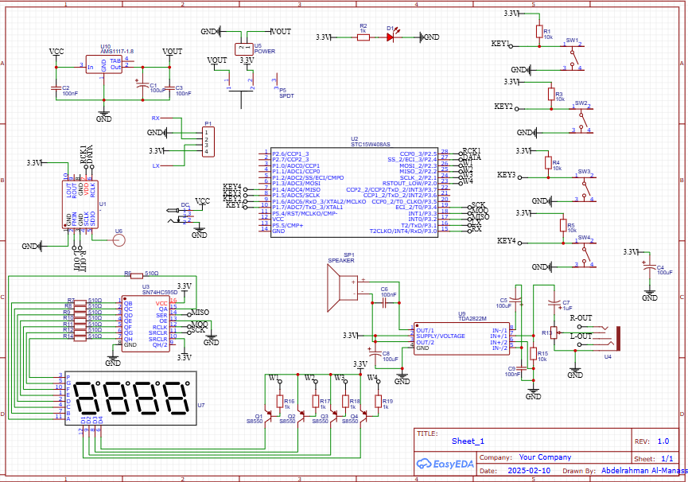
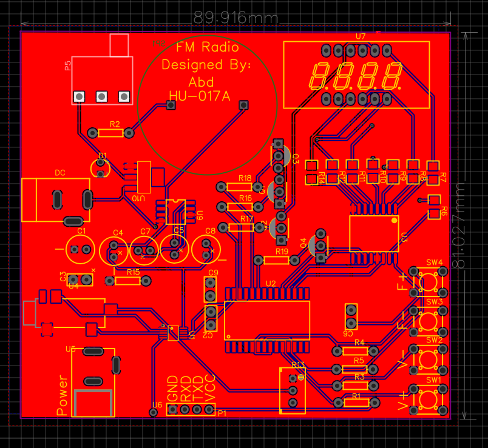

# Electronics-Portfolio
A showcase of my EasyEDA circuit designs.
# Project 1: FM Radio Receiver
# 📡 FM Radio Receiver Project

## 🔹 Overview
This project is an **FM radio receiver** built using the **STC15W408AS microcontroller** and the **RDA5807 radio module**. It includes a **7-segment display**, a **74HC595 shift register**, and an **AMS1117 voltage regulator**.

## 🔹 Features
- 📻 **FM Radio Reception** using the RDA5807 module.  
- 🔢 **7-Segment Display** to show frequency.  
- 🎛️ **Button Control** for tuning and volume adjustment.  
- 🔋 **3.3V Regulated Power Supply** with AMS1117.  

## 🔹 Schematic & PCB
Here are the **schematic** and **PCB model images**:

- **Schematic:**  
    
- **PCB:**
    
  
## 🔹 Components Used
| Component | Description |
|-----------|------------|
| **STC15W408AS** | Microcontroller |
| **RDA5807** | FM Radio Module |
| **74HC595** | Shift Register |
| **AMS1117** | Voltage Regulator |

## 🔹 How It Works
1. The **STC15W408AS** microcontroller communicates with the **RDA5807** radio module via I²C.  
2. The **7-segment display** is driven using the **74HC595** shift register.  
3. The **AMS1117 voltage regulator** provides **3.3V** power to the circuit.  
4. Users can **tune the frequency** using the onboard buttons.  

## 🔹 Future Improvements
- 🔧 Add an **OLED display** for better readability.  
- 📶 Improve **antenna reception** for better signal strength.  
- 🔊 Implement **automatic station scanning**.  
 

## 3D Model  
Here are the 3D images of the PCB layout:  

- **Top View**  
    
- **Side View**  
    
